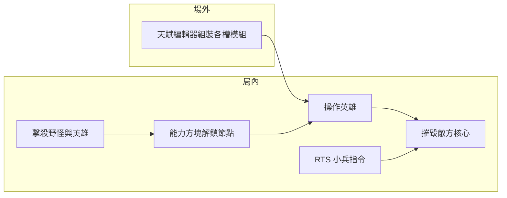
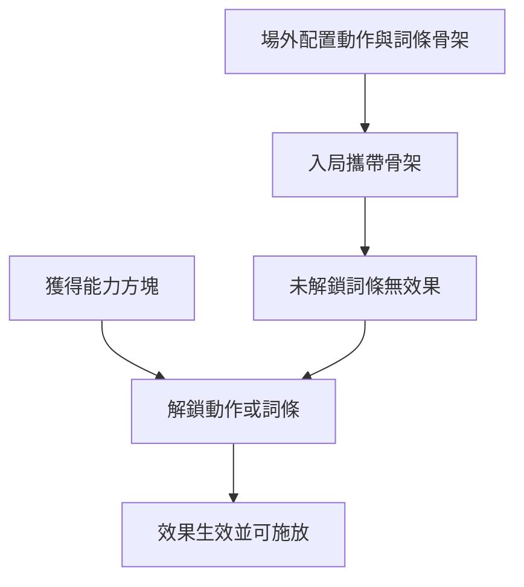

# 遊戲企劃書（GDD）

> **專案代號**：GamePJ260820  
> **引擎**：Unity 6（6000.0.39f1）+ URP  
> **文件版本**：0.5（天賦測試場）  
> **狀態標記**：【已確認】= 需求已鎖定；【草案】= 方向已定，數值待調

---

## 1. 概念與定位

【已確認】本作為 **3D 俯視 MOBA 競技遊戲**，核心勝利條件為摧毀對方基地核心（類 DOTA）。

【已確認】差異化賣點：

- **模組化技能／天賦樹**：玩家可在場外預先組裝，局內以「能力方塊」解鎖節點。
- **三主屬性各槽獨立語意**：力量／敏捷／智力分別作用於攻擊、續力、完美閃避、完美格擋等槽位，可混搭。
- **動作向戰鬥節奏**：續力、完美閃避、完美格擋構成技巧上限，而非純數值對撞。
- **英雄操作 + RTS 小兵指令**：玩家始終直接操控英雄，同時可對己方小兵下達進攻／集火等指令。

【草案】目標平台：PC（鍵鼠）；後續可評估手把與行動裝置。

### 1.1 核心玩法循環

【已確認】單局核心循環如下：

1. **勝利目標**：摧毀敵方核心（己方核心被摧毀則落敗）。
2. **雙軸操控**：直接操作英雄進行戰鬥與走位；另以 RTS 指令指使己方小兵進攻、集火、守線或撤退。
3. **資源取得**：擊殺野怪、參與或完成擊殺敵方英雄，獲得 **經驗值（XP）** 與 **能力方塊**。
4. **Build 成長**：場外預先組裝天賦樹骨架（各槽模組）；局內消耗能力方塊解鎖節點，強化技能與被動。
5. **戰場可讀性**：略傾斜俯視鏡頭，方便掌握兵線、野區與團戰位置。
6. **資訊戰**：對局進行一定時間後，依序揭露雙方天賦樹，後期可針對對手 Build 反制。



---

## 2. 勝利條件與對局結構

| 項目 | 說明 | 狀態 |
|------|------|------|
| 勝利條件 | 摧毀敵方核心 | 【已確認】 |
| 失敗條件 | 己方核心被摧毀 | 【已確認】 |
| 對局人數 | 【草案】5v5 或 3v3，待原型驗證節奏 | 【草案】 |
| 對局時長 | 【草案】25–40 分鐘 | 【草案】 |

### 2.1 地圖結構（草案）

- 雙方基地 + 核心建築
- 三路兵線 + 野區
- 中立野怪營地（資源來源）

---

## 3. 單位與操控

| 單位 | 操控方式 | 職責 |
|------|----------|------|
| 英雄 | 玩家直接操作（WASD + 滑鼠指向） | 主力輸出、技能、推線、團戰 |
| 小兵 | 玩家下達 RTS 指令（見 3.1） | 推塔、吸收傷害、視野、執行兵線戰術 |
| 野怪 | AI 中立 | 提供經驗值與能力方塊 |
| 核心 | 不可操作建築 | 勝負關鍵目標 |

【已確認】本階段雛形（M0）僅實作 **單一英雄** 的移動與動畫，不包含小兵 AI、RTS 指令與核心。

### 3.1 RTS 小兵指令層

【已確認】操控原則：

- 玩家 **始終直接操作英雄**；小兵不可切換為主控單位。
- 移動英雄與下達小兵指令 **可同時進行**（例如邊走位邊下令推線）。
- 指令對象僅限 **己方小兵群／當前兵線波次**；不可操作敵方單位或野怪。

【已確認】指令種類（具體按鍵【草案】）：

| 指令 | 說明 | 戰術用途 |
|------|------|----------|
| **進攻** | 指定路線或目標（敵塔／敵核心方向） | 推線、壓塔、終局衝核心 |
| **集火** | 指定單一敵方單位（英雄／塔／野怪） | 配合團戰秒殺關鍵目標 |
| **守線** | 於指定路線防守、清兵 | 穩線、防止被破塔 |
| **撤退** | 小兵後撤至安全位置（己方塔前／基地） | 保存兵線、避免被反打 |

【草案】指令範圍：以選取框或路線標記指定受令小兵；預設為「最近一路己方小兵群」。

【草案】實作里程碑：M3 基礎兵線 AI；M4 完整 RTS 指令與 UI。

### 3.2 戰鬥按鍵操作

【已確認】預設鍵位（可在設定中改鍵）：

| 動作 | 預設按鍵 | 取得方式 | 說明 |
|------|----------|----------|------|
| **攻擊 1** | 滑鼠左鍵 | 開局必有 | 主輸出技能槽 |
| **攻擊 2** | 滑鼠右鍵 | 開局必有 | 副輸出／功能性攻擊槽 |
| **閃避** | Shift | 開局 **二選一** | 完美閃避動作；與格擋初始互斥 |
| **格擋** | Space | 開局 **二選一** | 完美格擋動作；與閃避初始互斥 |
| **攻擊 3** | 【草案】Q | 天賦樹解鎖 | 第三攻擊槽 |
| **攻擊 4** | 【草案】E | 天賦樹解鎖 | 第四攻擊槽 |
| **攻擊 5** | 【草案】R | 天賦樹解鎖 | 第五攻擊槽；受 3 選 2 限制（見 §6.2） |
| **移動** | WASD | 開局必有 | — |
| **面向** | 滑鼠指向地面 | 開局必有 | 續力方向、完美操作判定 |

【已確認】開局規則：

- 每位玩家 **必定擁有** 攻擊 1、攻擊 2。
- **閃避與格擋初始只能擇一**（場外 Build 或首次進入時選定；另一動作需靠天賦樹另行解鎖，且受 §6.2 槽位上限約束）。
- 攻擊 3、4、5 需在天賦樹中 **預先配置並於局內解鎖** 後，才綁定對應按鍵並可施放。

【草案】續力操作：按住對應攻擊鍵蓄力；放開或蓄滿觸發（詳見 §5.2）。

---

## 4. 資源與成長

| 資源 | 取得方式 | 用途 |
|------|----------|------|
| 經驗值（XP） | 擊殺野怪、參與擊殺英雄、【草案】自然成長 | 英雄等級成長、【草案】部分天賦節點前置條件 |
| 能力方塊 | 擊殺野怪、擊殺英雄、【草案】任務／地圖事件 | 解鎖／升級技能模組與天賦節點 |

【已確認】資源分工：

- **XP**：管英雄等級與基礎成長曲線。
- **能力方塊**：管局內 **動作** 與 **詞條** 解鎖；與場外預設骨架配合，決定 Build 何時「開花」。

【已確認】能力方塊解鎖規則：

- 局內每獲得 1 個能力方塊，可解鎖天賦樹上的 **1 個動作** 或 **1 個詞條**。
- **未解鎖的動作／詞條不生效**（僅在 UI 上預覽場外配置）。
- 場外預設的「天賦骨架」決定可解鎖路線；局內只能沿骨架解鎖，**不能臨時改變分支結構**。

【已確認】完整解鎖經濟（攻擊向）：

- 計入經濟的 **5 個動作**：攻擊 1～攻擊 5。
- 每個動作：**1 動作本體 + 最多 4 修飾詞條**；每解鎖 1 段消耗 1 能力方塊。
- **5 動作 × 4 修飾詞條 = 20 個能力方塊** 可將五段攻擊的修飾槽完全解鎖（動作本體解鎖另計，或含於首格解鎖——【草案】待 M2 定案）。
- 閃避、格擋亦為 **動作本體 + 最多 4 修飾**，解鎖規則相同（不併入上述 20 方塊攻擊預算）。

---

## 5. 三主屬性模組系統（各槽獨立語意）

【已確認】玩家以 **力量（STR）／敏捷（AGI）／智力（INT）** 模組自由搭配。  
**各槽獨立**：攻擊方式由 **攻擊槽** 決定、續力由 **續力槽** 決定、完美閃避／格擋由 **對應槽** 決定——四槽可混搭不同屬性。

例如：**力量斬擊（攻擊）+ 敏捷續力（續力）+ 智力格擋（格擋）** 為合法 Build。

### 5.0 四槽總覽

| 槽位 | 決定什麼 | STR | AGI | INT |
|------|----------|-----|-----|-----|
| **攻擊／施放** | 動作形態與命中方式 | 打擊、斬擊 | 刺擊、射擊（物理） | 範圍（AOE）、射擊（魔法） |
| **續力／詠唱** | 蓄力期間與滿蓄效果 | 緩速敵人 → 控場／異常 | 自身加速 → 破防／異常 | 自身完全停止 → 緩速／異常 |
| **完美閃避** | 成功閃避的額外獎勵 | 恢復 CD、獲得續力%、增益 | 恢復 CD、發出追擊、增益 | 發出追擊、獲得續力%、增益 |
| **完美格擋** | 成功格擋的額外獎勵 | 霸體、傷害增加、快速反擊 | 脫離戰場、快速反擊、破防傷害 | 範圍擊退、傷害增加、破防傷害 |

### 5.1 攻擊／施放方式（攻擊槽）

| 主屬性 | 近戰 | 遠程 | 戰鬥特徵 |
|--------|------|------|----------|
| 力量 | 打擊、斬擊 | — | 高硬直、短距離高爆發 |
| 敏捷 | 刺擊 | 射擊（物理） | 快攻速、位移友好 |
| 智力 | 範圍（AOE） | 射擊（魔法） | 控場、持續傷害 |

【草案】互斥：同一攻擊槽 **近戰形態與遠程形態擇一**（例如斬擊 vs 物理射擊不可並存）。

### 5.2 續力／詠唱（續力槽）

**通用效果【已確認】**：續力期間 **攻擊範圍持續增加**（與續力槽屬性無關）。

| 主屬性 | 續力期間 | 續力滿（Perfect Charge） |
|--------|----------|---------------------------|
| 力量 | 自身與範圍內敵人 **持續緩速** | 附加 **控場／異常狀態** |
| 敏捷 | 自身 **持續加速** | 附加 **破防傷害／異常** |
| 智力 | 自身 **完全停止移動** | 附加 **緩速／異常** |

【草案】續力時間：0.5–2.0 秒可配置；滿續力窗口 ±【草案】80ms。

### 5.3 完美閃避（Perfect Dodge，閃避槽）

**通用效果【已確認】**：取消下一個動作的 **前搖（Startup）**。

| 主屬性 | 額外獎勵 |
|--------|----------|
| 力量 | 恢復冷卻、獲得續力%數、獲得增益 |
| 敏捷 | 恢復冷卻、發出追擊、獲得增益 |
| 智力 | 發出追擊、獲得續力%數、獲得增益 |

【草案】完美閃避判定窗口：受擊前 【草案】150–250ms；需消耗 【草案】耐力或次數。

### 5.4 完美格擋（Perfect Parry，格擋槽）

**通用效果【已確認】**：免疫該次傷害並獲得 **架式（Stance）**。

| 主屬性 | 額外獎勵 |
|--------|----------|
| 力量 | 霸體（無視控制）、傷害增加、快速反擊 |
| 敏捷 | 脫離戰場、快速反擊、破防傷害 |
| 智力 | 範圍擊退、傷害增加、破防傷害 |

【草案】架式持續 【草案】2–4 秒；期間下一次攻擊或技能獲得加成。

### 5.5 混搭與互斥規則

【已確認】：

- 四槽（攻擊、續力、閃避、格擋）**各自獨立**選擇 STR／AGI／INT 模組。
- **同一槽位** 不能同時裝備兩種屬性模組。

【草案】混搭範例：

| Build 名稱 | 攻擊槽 | 續力槽 | 閃避槽 | 格擋槽 | 玩法摘要 |
|------------|--------|--------|--------|--------|----------|
| **破陣先鋒** | STR 斬擊 | AGI 加速續力 | STR CD+續力% | INT 範圍擊退 | 近戰爆發、蓄力位移、格擋控場 |
| **風箏獵手** | AGI 物理射擊 | STR 緩速續力 | AGI 追擊 | AGI 脫離反擊 | 遠程風箏、蓄力緩敵、閃避追擊 |
| **霜環術士** | INT 範圍魔法 | INT 定點詠唱 | INT 追擊+續力% | INT 範圍擊退 | 純智控場與區域壓制 |

【草案】純屬性參考 Build（附例）：

- **重錘守衛（純力）**：斬擊 + 緩速續力 + 力閃避 + 力格擋。
- **影刺游俠（純敏）**：刺擊 + 加速續力 + 敏閃避 + 敏格擋。
- **霜環術士（純智）**：範圍魔法 + 定點詠唱 + 智閃避 + 智格擋。

### 5.6 戰鬥狀態與異常（詞彙表）

以下為企劃與實作共用詞彙；持續時間與數值均為【草案】，待 M1 原型調整。

| 狀態／效果 | 說明 | 【草案】參考 |
|------------|------|-------------|
| **緩速** | 移動速度降低 | 20–40%，1–3 秒 |
| **加速** | 移動速度提升 | 15–30%，續力期間或 1–2 秒 |
| **完全停止** | 無法主動位移（可受擊、可施法） | 續力期間 |
| **控場** | 硬控（暈眩、定身、擊飛等） | 0.3–1.0 秒 |
| **異常** | 持續傷害或疊層 debuff（毒、燃等） | 2–5 秒 |
| **霸體** | 免疫控制效果，仍可受傷 | 1–2 秒 |
| **架式** | 格擋成功後的強化窗口 | 2–4 秒 |
| **追擊** | 自動對目標追加一次短距離攻擊／技能 | 單次觸發 |
| **破防傷害** | 對格擋／護盾／架式目標的額外傷害 | +【草案】20–50% |
| **脫離戰場** | 短距離後撤／無敵幀位移 | 【草案】300–600 單位 |
| **範圍擊退** | 以自身為中心擊退周圍敵人 | 【草案】半徑 2–4m |
| **快速反擊** | 下一次攻擊前搖大幅縮短或立即出招 | 架式或格擋後單次 |
| **增益** | 攻擊力／攻速／護盾等正面 buff | 【草案】2–4 秒 |

---

## 6. 場外天賦樹／動作詞條系統

【已確認】天賦樹讓玩家為每個 **戰鬥動作** 自行搭配 **技能動作詞條**，形成個人 Build。詞條帶 **STR／AGI／INT** 標籤，決定該段效果遵循哪種屬性語意（見第 5 章）。

### 6.1 流程

1. **場外**：在天賦編輯器中為各 **動作槽**（攻擊 1～5、閃避、格擋）配置詞條序列，形成 Build 骨架。
2. **入局**：攜帶骨架進入對局；所有動作／詞條預設 **鎖定**（無效果）。
3. **局內**：每獲得 1 能力方塊，解鎖骨架上的 **1 個動作或 1 個詞條**；解鎖後該段效果才生效。



### 6.2 動作槽配置

【已確認】動作槽一覽：

| 動作槽 | 按鍵（預設） | 開局狀態 | 天賦樹 |
|--------|--------------|----------|--------|
| 攻擊 1 | 左鍵 | 必有 | 可改詞條 |
| 攻擊 2 | 右鍵 | 必有 | 可改詞條 |
| 攻擊 3 | 【草案】Q | 鎖 | 可新增 |
| 攻擊 4 | 【草案】E | 鎖 | 可新增 |
| 攻擊 5 | 【草案】R | 鎖 | 可新增 |
| 閃避 | Shift | **二選一** | 可改詞條／新增 |
| 格擋 | Space | **二選一** | 可改詞條／新增 |

【已確認】槽位上限——**{ 攻擊 5、閃避、格擋 } 三者最多 3 選 2**：

- 含開局已選的閃避或格擋在內，Build 中 **最多只能啟用其中 2 個動作槽**。
- 例：開局選 **閃避** → 可再啟用 **攻擊 5**，但不可同時再啟用 **格擋**；若要在 Build 中使用格擋，須放棄攻擊 5 或（若規則允許）替換原閃避。

【草案】攻擊 3、4 不受 3 選 2 限制，解鎖後即可使用（各仍受 4 詞條上限約束）。

### 6.3 詞條槽（每動作最多 4）

【已確認】每個動作槽有一條 **詞條列（Modifier Bar）**：

| 部分 | 數量 | 說明 |
|------|------|------|
| **動作本體** | 1（必備） | 決定動畫與基礎類型，如「斬擊 (STR)」「翻滾閃避 (AGI)」；**不佔**修飾 4 格 |
| **修飾詞條** | 最多 **4** | 續力、異常、追擊、破防等；**可重複同名詞條** |

【已確認】疊加規則：

- 修飾詞條可重複裝備，**數值線性疊加**（除非詞條註明唯一）。
- 例：動作本體 `斬擊 (STR)` + 修飾槽 4 格皆為 `加速續力-破防 [30%] (AGI)` → **加速續力斬擊，破防 +120%**（30% × 4）。

- 詞條標籤 `(STR/AGI/INT)` 決定該段使用哪種屬性規則（斬擊語意、加速續力、追擊獎勵等）。
- **同一動作內可混搭不同屬性詞條**（例如攻擊 1 用 STR 斬擊 + AGI 加速續力 + STR 擊暈）。

### 6.4 配置範例

**攻擊 1（左鍵）——近戰控場斬**

| 槽位 | 詞條 | 屬性 | 解鎖後效果摘要 |
|------|------|------|----------------|
| 1 | 斬擊 | STR | 近戰斬擊動作 |
| 2 | 加速續力 | AGI | 續力期間自身加速 |
| 3 | 擊暈 | STR | 滿續力或命中附加暈眩 |

**閃避（Shift）——翻滾追擊流**

| 槽位 | 詞條 | 屬性 | 解鎖後效果摘要 |
|------|------|------|----------------|
| 1 | 翻滾閃避 | AGI | 翻滾位移閃避動作 |
| 2 | 獲得續力% | STR | 成功閃避回饋續力進度 |
| 3 | 追擊 | AGI | 成功閃避後自動追擊 |

**攻擊 1——極限破防斬（疊加範例）**

| 類型 | 詞條 | 屬性 |
|------|------|------|
| 動作本體 | 斬擊 | STR |
| 修飾 1 | 加速續力-破防 [30%] | AGI |
| 修飾 2 | 加速續力-破防 [30%] | AGI |
| 修飾 3 | 加速續力-破防 [30%] | AGI |
| 修飾 4 | 加速續力-破防 [30%] | AGI |

> 4 格修飾皆解鎖時：完整效果為 **可加速續力的斬擊，破防 +120%**（30% × 4）。

### 6.5 詞條類型與編輯器

【草案】詞條分類（持續擴充）：

| 類別 | 範例詞條 | 常見屬性 |
|------|----------|----------|
| 動作本體 | 斬擊、刺擊、翻滾閃避、架盾格擋 | STR / AGI |
| 續力修飾 | 加速續力、緩速續力、定點詠唱 | AGI / STR / INT |
| 異常附加 | 擊暈、緩速、燃燒 | STR / INT |
| 完美操作 | 追擊、獲得續力%、快速反擊 | AGI / STR |
| 破防／傷害 | 破防 [N%]、傷害增加 | AGI / STR / INT |
| 被動 | 【草案】吸血、視野 | — |

【草案】編輯器限制：非法詞條組合提示、3 選 2 槽位校驗、總詞條數預覽、所需能力方塊總數顯示（攻擊 1～5 滿解鎖 = 20 方塊）。

【已確認】完整 **動作本體／修飾詞條名單、ID、草案數值** 見獨立登錄表：[ACTION_MODIFIER_REGISTRY.md](ACTION_MODIFIER_REGISTRY.md)（本 GDD 不重複整表，以避免雙處維護）。

---

## 7. 資訊戰：天賦樹揭露

【已確認】對局進行一定時間後，**依序揭露雙方天賦樹**（對手 Build 資訊逐漸可見）。

【草案】揭露節奏：

| 時間 | 揭露內容 |
|------|----------|
| 0:00 | 僅見自己完整天賦樹 |
| 8:00 | 揭露對手 **已解鎖** 節點（不含未解鎖） |
| 15:00 | 揭露對手 **場外預設骨架**（未解鎖節點顯示為鎖） |
| 22:00 | 完整對手天賦樹（含升級等級） |

【草案】戰術意義：前期保留試探與詐 Build 空間；中后期可針對對手四槽混搭（例如得知對手為力攻+敏續力）調整出装与集火策略。

---

## 8. 鏡頭與 UX

【已確認】

- **略傾斜俯視角**（約 45–55° pitch），Perspective 投影。
- 鏡頭跟隨可控英雄，戰場可讀性優先。
- 滑鼠指向決定角色面向（利於續力方向與完美操作判定）。

【草案】最低 UI 清單：

| 區塊 | 內容 |
|------|------|
| 小地圖 | 兵線、野區、塔、視野 |
| 英雄狀態 | 血條、資源、【草案】耐力 |
| 技能欄 | 攻擊 1～5、閃避／格擋按鍵、CD、續力指示 |
| 天賦樹面板 | 各動作詞條列、已解鎖／鎖定、對手揭露進度 |
| 資源計數 | 能力方塊、等級／XP |
| **RTS 指令列** | 進攻／集火／守線／撤退 + 路線／目標標記 |
| 指令回饋 | 受令小兵高亮、指令目標標記 |

---

## 9. 技術架構與目錄約定

```
GamePJ260820/
├── Docs/                          # 企劃與設計文件
├── Assets/
│   ├── Scenes/                    # TestArena, TalentTestArena, 正式對局場景
│   ├── Scripts/
│   │   ├── Player/                # HeroMotor, HeroAnimatorBridge, HeroInputController
│   │   ├── Camera/                # TiltedFollowCamera
│   │   ├── Combat/                # CombatActor, StatusController, CombatCaster
│   │   ├── Modules/               # 動作／詞條登錄、TalentBuild、TalentLoadout
│   │   ├── Arena/                 # 圓形競技場、沙包、測試場 Bootstrap
│   │   ├── UI/                    # TalentTestHud, TestArenaHints
│   │   └── Editor/                # 原型資產與測試場建置工具
│   ├── Prefabs/
│   ├── Art/Animations/
│   └── InputSystem_Actions.inputactions
```

### 9.1 主要美術資產（M0 更新）

| 用途 | 資產 |
|------|------|
| 角色 | `P09_Modular_Humanoid` → `P09_Human_Variant_Male.prefab` |
| 場景 | `ToonScapes/Spring Isles/Demo/Demo_Scene_Day.unity` |
| 動畫 | P09 人形 Idle / Run / Attack clip + `Hero_P09.controller` |
| 遊玩 Prefab | `Assets/Prefabs/Hero_P09.prefab` |

Editor 選單 **GamePJ → Setup P09 + ToonScapes Test Arena** 會自動組裝 `TestArena` 場景。

### 9.1.1 天賦測試場（Talent Test Arena）

【已確認】獨立場景 `Assets/Scenes/TalentTestArena.unity`，用於即時驗證動作本體與修飾詞條。

| 項目 | 說明 |
|------|------|
| 場地 | 圓形競技場：可見小圍牆 + 隱形空氣牆 |
| 英雄 | P09 英雄，WASD 移動、滑鼠面向、各槽測試攻擊／閃避／格擋 |
| 沙包 | 可重置、可自動攻擊、可進入格擋（測破防） |
| 天賦樹 UI | 為各動作槽搭配 1 個動作本體 + 最多 4 詞條；測試場全部解鎖、改完即生效 |
| 即時驗證 | 戰鬥紀錄顯示傷害公式、異常、續力%、完美閃避／格擋回饋 |

Editor 選單 **GamePJ → Setup Talent Test Arena** 會建立或重建此場景。

### 9.2 輸入

**M0（已實作）**

| 操作 | 按鍵 |
|------|------|
| 移動 | WASD / 方向鍵 |
| 面向 | 滑鼠指向地面 |
| 攻擊 1 | 滑鼠左鍵 |

**M1+（企劃鎖定，見 §3.2）**

| 操作 | 按鍵 |
|------|------|
| 攻擊 2 | 滑鼠右鍵 |
| 閃避 | Shift（與格擋二選一） |
| 格擋 | Space（與閃避二選一） |
| 攻擊 3～5 | 【草案】Q / E / R |

【草案】M4 追加：RTS 指令快捷鍵、集火點選、守線路線標記。

### 9.3 核心腳本職責（M0）

| 腳本 | 職責 |
|------|------|
| `HeroInputController` | 讀取 Input System，提供 Move／Attack 與測試場各槽按鍵 |
| `HeroMotor` | CharacterController 移動、滑鼠面向、閃避位移 |
| `HeroAnimatorBridge` | Speed／Attack 驅動 Animator |
| `TiltedFollowCamera` | 傾斜俯視跟隨 |
| `TalentLoadout` / `CombatCaster` | 天賦配置與攻擊／續力／閃避／格擋結算 |
| `TalentTestHud` | 天賦樹 UI + 即時戰鬥驗證 |

---

## 10. 開發里程碑

| 里程碑 | 內容 | 驗收 |
|--------|------|------|
| **M0** 測試場景 | 場地 + 單英雄移動／動畫 | WASD、滑鼠面向、攻擊動畫、俯視相機 |
| **M1** 基礎戰鬥 | 四槽續力／閃避／格擋框架、傷害與異常狀態 | **各槽屬性語意可獨立運作**（不必整套同屬性）；`TalentTestArena` 可即時驗證 |
| **M2** 模組解鎖 | 能力方塊、天賦樹 UI、場外編輯器 | 局內解鎖 **動作／詞條** 並影響對應按鍵行為 |
| **M3** 對線 + 核心 | 兵線、塔、核心勝敗 | 完整單局可結束；基礎兵線 AI |
| **M4** 野區 + 資訊戰 + RTS | 野怪、天賦揭露、**RTS 小兵指令** | **完整核心循環**（含資源、Build、指令、資訊戰） |

---

## 11. 風險與待決事項

| 項目 | 說明 | 優先級 |
|------|------|--------|
| 網路同步 | MOBA 需低延遲狀態同步；【草案】後期選 Mirror / Netcode | 高 |
| 完美操作輸入延遲 | 需輸入緩衝與伺服器驗證 | 高 |
| 模組組合爆炸 | 詞條池、4 槽疊加上限、3 選 2 需平衡模板 | 中 |
| 詞條疊加平衡 | 同名破防等線性疊加易過強，需上限或遞減 | 中 |
| RTS 指令複雜度 | 指令層與 MOBA 操作並存，需簡化預設指令與 UI | 中 |
| 鏡頭遮擋 | 傾斜角與建築高度需反覆調整 | 中 |
| 天賦揭露節奏 | 揭露過早／過晚皆影響競技公平，需 playtest | 中 |

---

## 附錄 A：名詞對照

| 中文 | 英文 | 說明 |
|------|------|------|
| 能力方塊 | Ability Cube | 解鎖 1 個動作或 1 個詞條的局內貨幣 |
| 動作槽 | Action Slot | 攻擊 1～5、閃避、格擋等可施放動作 |
| 詞條 | Modifier / Affix | 鑲嵌於動作槽的單段技能效果；可疊加 |
| 詞條列 | Modifier Bar | 單一動作下最多 4 個詞條的序列 |
| 續力 | Charge / Channel | 按住技能鍵蓄力 |
| 架式 | Stance | 完美格擋後的強化狀態 |
| 破防傷害 | Guard Break Damage | 對格擋／護盾的額外傷害 |
| 各槽獨立 | Per-Slot Attribute | 攻擊／續力／閃避／格擋槽各自決定屬性語意 |
| RTS 指令 | RTS Order | 對己方小兵的進攻／集火／守線／撤退命令 |
| 登錄表 | Registry | 動作本體與修飾詞條名單、ID 與草案數值；見 [ACTION_MODIFIER_REGISTRY.md](ACTION_MODIFIER_REGISTRY.md) |

---

*文件結束 — v0.5 更新：天賦測試場（圓形競技場、沙包、即時詞條驗證）*
